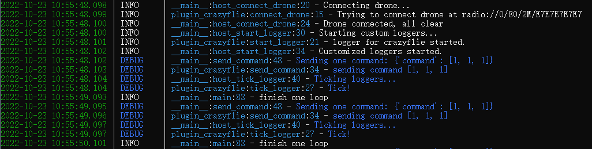

# drone_data_collect

一个插件化的异步无人机测试框架（完善中）




### 使用方法

```shell
> poetry install    #构建poetry虚拟环境
> poetry shell    #进入poetry虚拟环境
> cd drone_data_collect
> python main.py
```

### 基本内容

* 在main loop中每0.1s完成一次指令周转（通过异步睡眠来保证尽可能的精确，或许有其他解决办法?），在更换机型时可以更改导入的插件，快速应用改变

* 通过config.toml可以更方便的导入配置项

* 理论上能够支持集群化多机型同时测试（画饼）

### 钩子函数

hooks.py中定义了多个可用的钩子函数，如：

```python
@hookspec
def connect_drone(drone_config: dict) -> bool:
    """
    establish the connection between drone and host
    """


@hookspec
def start_logger(logger_config: dict) -> bool:
    """
    start logging (enableing customized config)
    """


@hookspec
def tick_logger(logger_config: dict) -> bool:
    """
    record one piece of logging
    """


@hookspec
def send_command(command: dict) -> bool:
    """
    send one command to drone
    """
```

### TODO

- [ ] 完善钩子函数

- [ ] 实现配置机型的对应插件自动导入

- [ ] 对插件中未完成的钩子函数进行warning

- [ ] 钩子函数异步化


